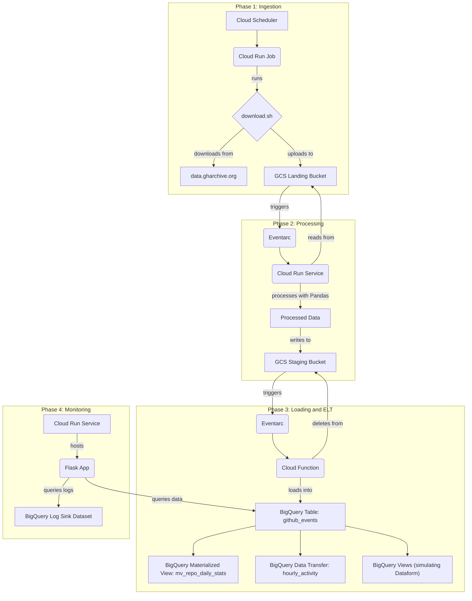

```mermaid
graph TD
    subgraph "Phase 1: Ingestion"
        A[Cloud Scheduler] --> B(Cloud Run Job);
        B -- runs --> C{download.sh};
        C -- downloads from --> D[data.gharchive.org];
        C -- uploads to --> E[GCS Landing Bucket];
    end

    subgraph "Phase 2: Processing"
        E -- triggers --> F(Eventarc);
        F --> G(Cloud Run Service);
        G -- reads from --> E;
        G -- processes with Pandas --> H[Processed Data];
        H -- writes to --> I[GCS Staging Bucket];
    end

    subgraph "Phase 3: Loading and ELT"
        I -- triggers --> J(Eventarc);
        J --> K(Cloud Function);
        K -- loads into --> L[BigQuery Table: github_events];
        K -- deletes from --> I;
        L --> M[BigQuery Materialized View: mv_repo_daily_stats];
        L --> O[BigQuery Data Transfer: hourly_activity];
        L --> P["BigQuery Views (simulating Dataform)"];
    end

    subgraph "Phase 4: Monitoring"
        Q[Cloud Run Service] -- hosts --> R(Flask App);
        R -- "queries logs" --> S[BigQuery Log Sink Dataset];
        R -- "queries data" --> L;
    end
```
