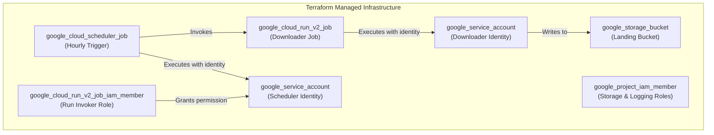

# Phase 1 Infrastructure Design: GitHub Archive Ingestion

## 1. Executive Summary

This document outlines the infrastructure design for Phase 1, the GitHub Archive Ingestion pipeline. The infrastructure is managed declaratively using Terraform, following a layered deployment strategy to separate resources by their lifecycle and dependencies. This approach ensures consistent, repeatable, and auditable environments. The core components include Google Cloud Storage for raw data, Cloud Run Jobs for serverless compute, and Cloud Scheduler for orchestration, all provisioned and configured via Terraform.

## 2. Architecture and Resources

The infrastructure provisions the components necessary to execute the application logic defined in the [Phase 1 Application Design](./src/github_archive/phase1_ingestion/phase1_design.md).

### High-Level Resource Diagram



### Key Terraform Resources

| Component | Terraform Resource Type | Purpose |
|-----------|---------------------------|---------|
| **Storage** | `google_storage_bucket` | Stores raw `.json.gz` files from GitHub Archive. |
| **Compute** | `google_cloud_run_v2_job` | Ephemeral container to download and upload data. |
| **Orchestrator**| `google_cloud_scheduler_job`| Triggers the Cloud Run Job on an hourly schedule. |
| **Identity** | `google_service_account` | Dedicated identities for the downloader and scheduler. |
| **Permissions**| `google_project_iam_member` | Grants project-level roles (e.g., logging) to SAs. |
| **Permissions**| `google_cloud_run_v2_job_iam_member` | Grants the scheduler SA permission to invoke the job. |

## 3. Layered Deployment Strategy

To manage resources with different lifecycles and dependencies, the Terraform configuration is deployed in three distinct layers. This strategy is orchestrated by the `infrastructure/scripts/phase1_deploy_layered.sh` script, which uses Terraform's `-target` flag to apply resources selectively.

### Layer 1: Foundation (Static)

This layer provisions foundational, long-lived resources that rarely change. It establishes the necessary identities and storage before any compute resources are created.

*   **Purpose**: Create service accounts, IAM bindings, and the GCS landing bucket.
*   **Lifecycle**: Deployed once per environment.
*   **Terraform Targets**:
    *   `google_service_account.github_archive_downloader`
    *   `google_service_account.scheduler`
    *   `google_project_iam_member.github_archive_downloader_storage`
    *   `google_project_iam_member.github_archive_downloader_logging`
    *   `google_storage_bucket.github_archive_landing`

### Layer 2: Compute (Operational)

This layer deploys the application's compute component. It depends on the service account from Layer 1 and the prior existence of a container image in Artifact Registry.

*   **Purpose**: Deploy the Cloud Run Job that contains the ingestion logic.
*   **Lifecycle**: Deployed on every CI/CD run or code change.
*   **Terraform Target**:
    *   `google_cloud_run_v2_job.github_archive_downloader`

### Layer 3: Automation (Orchestration)

The final layer connects the components by creating the scheduler and granting it permission to invoke the job from Layer 2.

*   **Purpose**: Create the Cloud Scheduler job and its IAM binding to the Cloud Run Job.
*   **Lifecycle**: Deployed after the compute layer is confirmed to be working.
*   **Terraform Targets**:
    *   `google_cloud_run_v2_job_iam_member.scheduler_github_invoker`
    *   `google_cloud_scheduler_job.github_archive_download`

## 4. Configuration and State Management

### 4.1. Dynamic Configuration

The infrastructure is designed to be environment-agnostic. Key variables are passed into the Terraform configuration at runtime by the deployment script.

*   `var.project_id`: The target Google Cloud project ID.
*   `var.environment`: A string (e.g., `dev`, `test`) used to prefix resource names for strict isolation.
*   `var.region`: The GCP region for deployment (e.g., `us-central1`).

### 4.2. State Management

To enable collaboration and use in CI/CD pipelines, the Terraform state is stored remotely in a GCS backend. This prevents state file conflicts and ensures a single source of truth for the infrastructure's state. The state bucket is created and versioned by the `create-terraform-deployer-account.sh` script.

## 5. Security and IAM

The principle of least privilege is applied by creating dedicated service accounts with narrowly scoped roles.

### 5.1. Service Identities

*   **Downloader Service Account** (`github-archive-downloader@...`): The identity for the Cloud Run Job.
    *   `roles/storage.objectAdmin`: Allows the job to write files to the GCS landing bucket.
    *   `roles/logging.logWriter`: Allows the job to write execution logs to Cloud Logging.

*   **Scheduler Service Account** (`scheduler-sa@...`): The identity for the Cloud Scheduler job.
    *   `roles/run.invoker`: Granted specifically on the Cloud Run Job resource, allowing it to trigger executions.

### 5.2. Deployer Identity

The entire deployment is performed by a dedicated `terraform-deployer` service account. The `test-phase1-permissions.sh` script validates that this account has the necessary permissions *before* a deployment is attempted, including:

*   `iam.serviceAccounts.create`
*   `storage.buckets.create`
*   `run.jobs.create`
*   `cloudscheduler.jobs.create`
*   `resourcemanager.projects.setIamPolicy`

## 6. Deployment and Verification

### 6.1. Deployment Orchestration

The `phase1_deploy_layered.sh` script is the designated tool for applying the Terraform configuration. It automates the following steps:

1.  **Pre-flight Checks**: Validates the presence of the deployer SA key file.
2.  **Authentication**: Exports the `GOOGLE_APPLICATION_CREDENTIALS` environment variable.
3.  **Terraform Init**: Initializes the GCS backend.
4.  **Layered Apply**: Creates a `.tfplan` for each layer and prompts for confirmation before applying. This provides critical review gates.

### 6.2. Manual Verification Gates

The deployment script intentionally pauses between layers and provides `gcloud` and `gsutil` commands to allow the operator to manually verify the successful creation and functionality of resources in one layer before proceeding to the next.

*   **After Layer 1**: Prompts to verify the GCS bucket and service accounts.
    ```bash
    gsutil ls gs://${PROJECT_ID}-${ENVIRONMENT}-github-archive-landing
    ```
*   **After Layer 2**: Prompts to manually execute the Cloud Run Job to ensure it works before the scheduler is enabled.
    ```bash
    gcloud run jobs execute ${ENVIRONMENT}-github-archive-download-gsutil --region=${REGION}
    ```
*   **After Layer 3**: Provides commands to verify the Cloud Scheduler job and view recent job executions.
    ```bash
    gcloud scheduler jobs describe ${ENVIRONMENT}-github-archive-download-job --location=${REGION}
    ```

