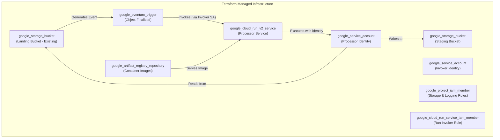

# Phase 2 Infrastructure Design: GitHub Archive Processing

## 1. Executive Summary

This document outlines the infrastructure design for Phase 2, the Processing pipeline. The infrastructure is managed declaratively using Terraform, following a layered deployment strategy to handle the complexities of serverless event-driven architectures. The core components include a Cloud Run Service (v2) for processing, Eventarc for event delivery from Cloud Storage, and Artifact Registry for container image management. This setup ensures a scalable, serverless execution environment that reacts immediately to new data ingestion.

## 2. Architecture and Resources

The infrastructure provisions the components necessary to execute the application logic defined in the [Phase 2 Application Design](../../../../src/github_archive/phase2_process_files/phase2_design.md).

### High-Level Resource Diagram



### Key Terraform Resources

| Component | Terraform Resource Type | Purpose |
|-----------|---------------------------|---------|
| **Storage** | `google_storage_bucket` | Stores processed `.ndjson.gz` files (Staging). |
| **Compute** | `google_cloud_run_v2_service` | Scalable serverless container to process files. |
| **Trigger** | `google_eventarc_trigger` | Captures GCS events and routes them to Cloud Run. |
| **Registry**| `google_artifact_registry_repository` | Hosts the Docker container images. |
| **Identity** | `google_service_account` | Dedicated identities for processing and invoking. |
| **Permissions**| `google_project_iam_member` | Grants necessary roles to Service Accounts. |

## 3. Layered Deployment Strategy

To manage dependencies between IAM propagation, API enablement, and resource creation, the Terraform configuration is deployed in three distinct layers. This is orchestrated by the `phase2_layered_deployment_script.sh`.

### Layer 1: Static (Foundation)

This layer provisions foundational resources that are stateful or required for identity management.

*   **Purpose**: Create Service Accounts, IAM bindings, and the Staging Bucket.
*   **Lifecycle**: Deployed once per environment.
*   **Terraform Targets**:
    *   `google_service_account.github_archive_processor`
    *   `google_service_account.eventarc_invoker`
    *   `google_storage_bucket.github_archive_staging`
    *   `google_project_iam_member` (Storage, Logging, and Pub/Sub Token Creator roles)

### Layer 2: First-Time (Enablement)

This layer handles project-level configurations and resources that prepare the environment for application deployment.

*   **Purpose**: Enable required APIs and create the Artifact Registry repository.
*   **Lifecycle**: Deployed once per project/region.
*   **Terraform Targets**:
    *   `google_project_service` (Enabling `run`, `eventarc`, `artifactregistry` APIs)
    *   `google_artifact_registry_repository.github_archive_repo`

### Layer 3: Operational (Application)

This layer deploys the active application components. It depends on the artifacts from Layer 2 (Docker image) and identities from Layer 1.

*   **Purpose**: Deploy the Cloud Run Service and the Eventarc Trigger.
*   **Lifecycle**: Deployed on every CI/CD run or code change.
*   **Terraform Targets**:
    *   `google_cloud_run_v2_service.github_archive_processor`
    *   `google_cloud_run_service_iam_member.authorize_invoker`
    *   `google_eventarc_trigger.gcs_trigger`

## 4. Security and IAM

Phase 2 employs a strict "least privilege" security model, separating the identity that *runs* the code from the identity that *invokes* it.

### 4.1. Service Identities

*   **Processor Service Account** (`github-archive-processor@...`): The identity for the Cloud Run Service.
    *   `roles/storage.objectViewer`: Read access to the landing bucket.
    *   `roles/storage.objectAdmin`: Read/Write/Delete access to the staging bucket (required for idempotent reprocessing).
    *   `roles/logging.logWriter`: Write application logs.

*   **Invoker Service Account** (`eventarc-invoker@...`): The identity used by Eventarc.
    *   `roles/run.invoker`: Granted explicitly on the Cloud Run Service, allowing it to trigger execution.
    *   `roles/eventarc.eventReceiver`: Permission to receive events from the provider.

*   **Pub/Sub Service Agent**:
    *   `roles/iam.serviceAccountTokenCreator`: Granted to the Google-managed Pub/Sub agent on the **Invoker SA**. This allows Pub/Sub to generate OIDC tokens to authenticate the push request to Cloud Run.

## 5. Deployment and Verification

### 5.1. Deployment Orchestration

The `phase2_layered_deployment_script.sh` automates the complex dependency chain. It supports flags like `--layer all`, `--layer operational`, and `--use-cloud-build` to handle different deployment scenarios (initial setup vs. code updates).

### 5.2. Verification Gates

*   **After Layer 1 (Static)**: Verify the Staging bucket and IAM roles.
    ```bash
    gsutil ls gs://${PROJECT_ID}-${ENVIRONMENT}-github-archive-staging
    ```
*   **After Layer 3 (Operational)**: Verify the service health and trigger status.
    ```bash
    curl -H "Authorization: Bearer $(gcloud auth print-identity-token)" \
      https://${ENVIRONMENT}-github-archive-processor-${PROJECT_ID}.${REGION}.run.app/health
    
    gcloud eventarc triggers list --location=${REGION}
    ```