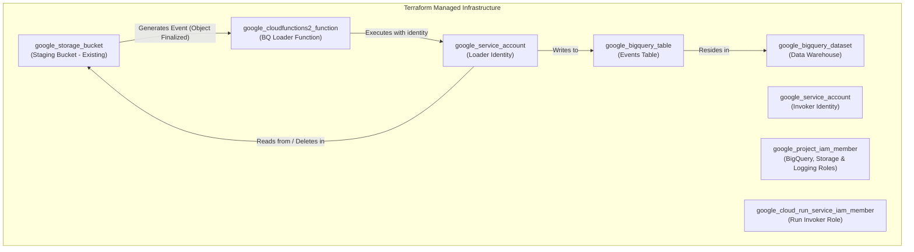

# Phase 3 Infrastructure Design: BigQuery Loader

## 1. Executive Summary

This document details the infrastructure for Phase 3, the BigQuery Loading pipeline. This phase is responsible for loading the processed `.ndjson.gz` files from the GCS Staging bucket into the final BigQuery data warehouse. The infrastructure is managed declaratively using Terraform and follows the project's layered deployment strategy. The core component is a 2nd Generation Cloud Function, which provides a serverless, event-driven solution that is both cost-effective and scalable.

## 2. Architecture and Resources

The infrastructure provisions the components necessary to execute the application logic defined in the Phase 3 Application Design.

### High-Level Resource Diagram



### Key Terraform Resources

| Component | Terraform Resource Type | Purpose |
|-----------|---------------------------|---------|
| **Data Warehouse** | `google_bigquery_dataset` | The BigQuery dataset to house our tables. |
| **Data Warehouse** | `google_bigquery_table` | The main partitioned and clustered table for GitHub events. |
| **Compute** | `google_cloudfunctions2_function` | Serverless function to orchestrate the BQ load job. |
| **Trigger** | `event_trigger` (block) | A built-in block within the function resource that creates an Eventarc trigger. |
| **Identity** | `google_service_account` | Dedicated identities for the loader and the invoker. |
| **Permissions**| `google_project_iam_member` | Grants necessary project-level roles to the Loader Service Account. |
| **Permissions**| `google_cloud_run_service_iam_member` | Grants the Invoker SA permission to invoke the function (as 2nd Gen functions run on Cloud Run). |

## 3. Layered Deployment Strategy

The Terraform configuration for Phase 3 is deployed in three layers to manage dependencies and resource lifecycles effectively. This is orchestrated by the `deploy-all-phases.sh` script.

### Layer 1: Static (Foundation)

This layer provisions the stateful, foundational resources that rarely change.

*   **Purpose**: Create Service Accounts, the BigQuery Dataset and Table, and associated IAM bindings.
*   **Lifecycle**: Deployed once per environment.
*   **Terraform Targets**:
    *   `google_service_account.bq_loader`
    *   `google_service_account.eventarc_invoker`
    *   `google_bigquery_dataset.github_archive`
    *   `google_bigquery_table.github_events`
    *   `google_project_iam_member` (for the loader SA)

### Layer 2: First-Time (Enablement)

This layer handles one-time project-level configurations.

*   **Purpose**: Enable the `cloudfunctions.googleapis.com` and `bigquery.googleapis.com` APIs.
*   **Lifecycle**: Deployed once per project.
*   **Terraform Targets**:
    *   `google_project_service` resources

### Layer 3: Operational (Application)

This layer deploys the active application component that changes with code updates.

*   **Purpose**: Deploy the Cloud Function, including its event trigger configuration.
*   **Lifecycle**: Deployed on every CI/CD run or code change.
*   **Terraform Targets**:
    *   `google_cloudfunctions2_function.bq_loader`

## 4. Security and IAM

Phase 3 adheres to the principle of least privilege by using dedicated service accounts for distinct responsibilities.

### 4.1. Service Identities

*   **BQ Loader Service Account** (`bq-loader@...`): The identity the Cloud Function executes with.
    *   `roles/bigquery.dataEditor`: To write data into the BigQuery table.
    *   `roles/bigquery.jobUser`: To create and run BigQuery load jobs.
    *   `roles/storage.objectAdmin`: To read files from the staging bucket and delete them after a successful load.
    *   `roles/logging.logWriter`: To write application logs.

*   **Eventarc Invoker Service Account** (`eventarc-invoker@...`): The identity used by the Eventarc trigger to invoke the function.
    *   `roles/run.invoker`: Granted on the Cloud Function, allowing it to trigger an execution. 2nd Gen Cloud Functions are built on Cloud Run, hence the `run.invoker` role.
    *   `roles/eventarc.eventReceiver`: Standard permission to receive events.

*   **Pub/Sub Service Agent**:
    *   `roles/iam.serviceAccountTokenCreator`: Granted to the Google-managed Pub/Sub agent on the **Invoker SA**. This is a critical permission that allows the underlying Pub/Sub topic (created by Eventarc) to generate the OIDC token needed to make an authenticated call to the Cloud Function.

*   **Cloud Build Service Account** (`cloud-build@...`): A dedicated, user-managed service account used by Cloud Build to build and deploy the function's source code.
    *   `roles/artifactregistry.writer`: To push the function's container image to Artifact Registry.
    *   `roles/storage.objectAdmin`: To manage build artifacts in GCS.

## 5. Deployment and Verification

### 5.1. Deployment Orchestration

The `deploy-all-phases.sh` script handles the deployment of all three layers in the correct order, passing necessary variables like `project_id` and `staging_bucket_name` between them.

### 5.2. Verification Gates

*   **After Layer 1 (Static)**: Verify the BigQuery table exists with the correct schema.
    ```bash
    bq show --schema --format=prettyjson ${PROJECT_ID}:github_archive.github_events
    ```
*   **After Layer 3 (Operational)**: Verify the Cloud Function and its associated trigger are active.
    ```bash
    # Check the function status
    gcloud functions describe dev-bq-loader --gen2 --region ${REGION}

    # Check the implicit Eventarc trigger created by the function
    gcloud eventarc triggers list --location=${REGION} --filter="name~dev-bq-loader"
    ```
*   **End-to-End Test**: Upload a test file to the staging bucket and confirm the data appears in the BigQuery table.
    ```bash
    gsutil cp test.ndjson.gz gs://${PROJECT_ID}-${ENVIRONMENT}-github-archive-staging/
    # Wait a minute, then query
    bq query --project_id=${PROJECT_ID} "SELECT count(*) FROM github_archive.github_events WHERE etl_create_ts > TIMESTAMP_SUB(CURRENT_TIMESTAMP(), INTERVAL 5 MINUTE)"
    ```

