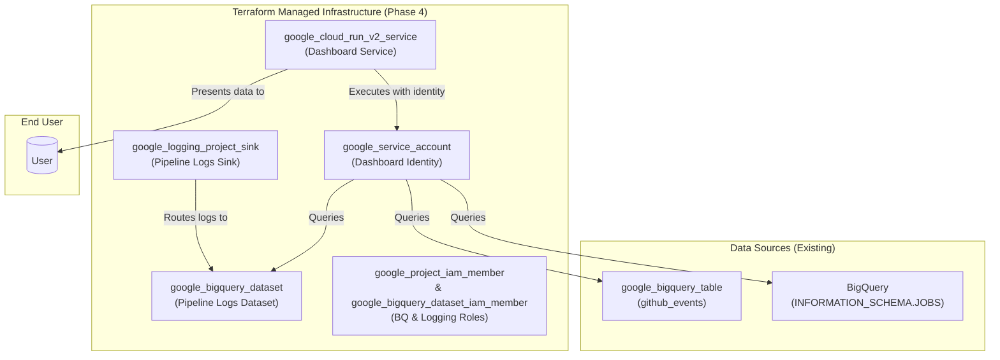

# Phase 4 Infrastructure Design: Monitoring Dashboard

## 1. Executive Summary

This document outlines the infrastructure design for Phase 4, the Monitoring Dashboard. This phase provides a consolidated, near real-time view of the entire data pipeline's health, performance, and operational status. The infrastructure is managed declaratively using Terraform and follows the project's layered deployment strategy. The core component is a Cloud Run v2 service that hosts a Streamlit web application. This service is granted read-only access to various BigQuery data sources, including the final events table, log sinks, and job metadata, to generate its visualizations.

## 2. Architecture and Resources

The infrastructure provisions the components necessary to execute the application logic defined in the [Phase 4 Application Design](../../../../src/github_archive/phase4_monitoring/phase4_design.md). The dashboard is a read-only consumer of data produced by the other pipeline phases.

### High-Level Resource Diagram



### Key Terraform Resources

| Component | Terraform Resource Type | Purpose |
|-----------|---------------------------|---------|
| **Compute** | `google_cloud_run_v2_service` | Hosts the Streamlit Python web application. |
| **Identity** | `google_service_account` | Dedicated identity for the dashboard with read-only data access. |
| **Logging** | `google_logging_project_sink` | Creates a sink to route pipeline logs to a BigQuery dataset for analysis. |
| **Logging** | `google_bigquery_dataset` | Stores the logs generated by the pipeline components (Phases 1, 2, 3). |
| **Permissions**| `google_project_iam_member` | Grants project-level roles (e.g., BigQuery Job User, Log Writer). |
| **Permissions**| `google_bigquery_dataset_iam_member` | Grants dataset-level read access to the dashboard's Service Account. |

## 3. Layered Deployment Strategy

To manage dependencies and resource lifecycles, the Terraform configuration for Phase 4 is deployed in three layers, orchestrated by the `deploy-all-phases.sh` script.

### Layer 1: Static (Foundation)

This layer provisions the foundational resources for logging and identity.

*   **Purpose**: Create the dashboard's Service Account, the BigQuery dataset for logs, the log sink, and the necessary IAM bindings.
*   **Lifecycle**: Deployed once per environment.
*   **Terraform Targets**:
    *   `google_service_account.pipeline_dashboard`
    *   `google_bigquery_dataset.pipeline_logs`
    *   `google_logging_project_sink.pipeline_logs_sink`
    *   `google_project_iam_member` (for the dashboard SA)
    *   `google_bigquery_dataset_iam_member` (for the dashboard SA)

### Layer 2: First-Time (Enablement)

This layer handles one-time project-level configurations.

*   **Purpose**: Enable the `run.googleapis.com` and `logging.googleapis.com` APIs.
*   **Lifecycle**: Deployed once per project.
*   **Terraform Targets**:
    *   `google_project_service` resources

### Layer 3: Operational (Application)

This layer deploys the active dashboard application. It depends on a container image being available in Artifact Registry.

*   **Purpose**: Deploy the Cloud Run Service for the dashboard.
*   **Lifecycle**: Deployed on every CI/CD run or code change.
*   **Terraform Targets**:
    *   `google_cloud_run_v2_service.pipeline_dashboard`

## 4. Security and IAM

The dashboard follows the principle of least privilege, using a dedicated service account with narrowly scoped, read-only permissions to its data sources.

### 4.1. Service Identity

*   **Dashboard Service Account** (`${env}-pipeline-dashboard@...`): The identity the Cloud Run service executes with.
    *   `roles/bigquery.dataViewer`: Granted on the `github_archive` dataset to read the final events table.
    *   `roles/bigquery.dataViewer`: Granted on the `_pipeline_logs` dataset to read the log data.
    *   `roles/bigquery.resourceViewer`: Granted on the **project** to query `INFORMATION_SCHEMA.JOBS` for job metadata.
    *   `roles/bigquery.jobUser`: Granted on the **project** to allow the service to execute query jobs.
    *   `roles/logging.logWriter`: Granted on the **project** to allow the dashboard service to write its own operational logs.

### 4.2. Log Sink Permissions

When the `google_logging_project_sink` is created, Cloud Logging automatically grants the sink's unique service account identity the `roles/bigquery.dataEditor` role on the destination BigQuery dataset. This is managed by Google Cloud.

## 5. Deployment and Verification

### 5.1. Deployment Orchestration

The `deploy-all-phases.sh` script handles the deployment of all three layers in the correct order. The operational layer deployment for Phase 4 typically involves a Cloud Build step to build the dashboard's container image before applying the Terraform configuration.

### 5.2. Verification Gates

*   **After Layer 1 (Static)**: Verify the log sink and its destination dataset have been created.
    ```bash
    # Verify the log sink
    gcloud logging sinks describe ${ENVIRONMENT}-pipeline-logs-sink --project=${PROJECT_ID}

    # Verify the BigQuery dataset for logs
    bq show ${PROJECT_ID}:${ENVIRONMENT}_pipeline_logs
    ```

*   **After Layer 3 (Operational)**: Verify the Cloud Run service is deployed and healthy, then retrieve its URL.
    ```bash
    # Describe the service to check its status
    gcloud run services describe ${ENVIRONMENT}-monitoring-dashboard --region ${REGION} --project=${PROJECT_ID}

    # Get the URL from the output and open it in a browser
    DASHBOARD_URL=$(gcloud run services describe ${ENVIRONMENT}-monitoring-dashboard --region ${REGION} --project=${PROJECT_ID} --format 'value(status.url)')
    echo "Dashboard URL: ${DASHBOARD_URL}"
    ```

*   **End-to-End Test**: Access the dashboard URL in a web browser. The dashboard should load and display metrics queried from BigQuery. If the pipeline has just been deployed, it may take a few minutes for log data to appear. The dashboard is designed to handle the initial absence of log tables gracefully.

```
<!--
[PROMPT_SUGGESTION]Based on the new infrastructure document, create a layered deployment script specifically for Phase 4.[/PROMPT_SUGGESTION]
[PROMPT_SUGGESTION]Review all the `phaseX_infrastructure.md` files and identify any inconsistencies in the documented IAM roles versus the deployment scripts.[/PROMPT_SUGGESTION]
