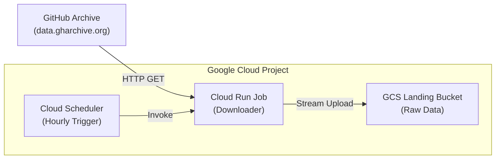

# Phase 1 Design: GitHub Archive Ingestion

## 1. Executive Summary

Phase 1 establishes the data ingestion foundation for the pipeline. Its primary objective is to reliably download hourly JSON event data from the public GitHub Archive project and store it in a raw format in Google Cloud Storage (GCS). This phase utilizes serverless compute (Cloud Run Jobs) triggered by a cron schedule (Cloud Scheduler) to ensure cost-effective, zero-maintenance operations.

## 2. Architecture Overview

### High-Level Data Flow



### Key Components

| Component | Resource Type | Name Pattern | Responsibility |
|-----------|--------------|--------------|----------------|
| **Orchestrator** | Cloud Scheduler | `${env}-github-archive-download-job` | Triggers the ingestion job at fixed hourly intervals (Minute 30). |
| **Compute** | Cloud Run Job (v2) | `${env}-github-archive-download-gsutil` | ephemeral worker that calculates the correct time window, downloads the file, and streams it to storage. |
| **Storage** | Cloud Storage Bucket | `${project_id}-${env}-github-archive-landing` | Stores raw `.json.gz` files with a lifecycle policy. |
| **Identity** | Service Account | `github-archive-downloader@...` | Identity for the Cloud Run Job with permissions to write to GCS. |

## 3. Detailed Technical Design

### 3.1. Ingestion Logic (Cloud Run Job)

The core logic is encapsulated in a Docker container (`github-archive-downloader`) running a shell script.

*   **Source URL**: `http://data.gharchive.org/{YYYY}-{MM}-{DD}-{H}.json.gz`
*   **Protocol**: HTTP/1.1
*   **Download Method**: Streaming pipe (`curl | gsutil`).
    *   *Constraint*: `gsutil` does not support HTTP sources directly.
    *   *Solution*: `curl -fsSL "${URL}" | gsutil cp - "${TARGET_GS_PATH}"`
*   **Date Handling**:
    *   **Timezone**: UTC (Canonical for GitHub Archive).
    *   **Target Hour**: `1 hour ago` from execution time.
    *   **Format quirk**: GitHub Archive uses `%-H` (no leading zero) for hours 0-9.
    *   *Linux Command*: `date -u -d "1 hour ago" '+%Y-%m-%d-%-H'`

### 3.2. Scheduling Strategy

*   **Schedule**: `30 * * * *` (30 minutes past every hour).
*   **Rationale**:
    *   GitHub Archive typically finalizes the previous hour's file by minute 15-20.
    *   Running at minute 30 provides a safety buffer to prevent 404 errors.
*   **Timezone**: Etc/UTC.

### 3.3. Storage Design

*   **Bucket Name**: `${project_id}-${env}-github-archive-landing`
*   **Object Path**: `github-archive/raw/{YYYY}/{MM}/{DD}/{YYYY}-{MM}-{DD}-{H}.json.gz`
*   **Lifecycle Policy**:
    *   **Age**: 6 days (Delete objects older than 6 days).
    *   **Reasoning**: Free tier limit is 5GB. Hourly files ~35MB * 24 * 6 ≈ 5GB.
    *   **Data Flow**: Phase 2 (Processing) picks up files immediately; this bucket is transient.

### 3.4. Security & IAM

**Service Account**: `github-archive-downloader@{project}.iam.gserviceaccount.com`

| Role | Resource | Purpose |
|------|----------|---------|
| `roles/storage.objectAdmin` | Landing Bucket | Create and manage objects (upload raw files). |
| `roles/logging.logWriter` | Project | Write execution logs to Cloud Logging. |

**Service Account**: `scheduler-sa@{project}.iam.gserviceaccount.com`

| Role | Resource | Purpose |
|------|----------|---------|
| `roles/run.invoker` | Cloud Run Job | Permission to execute the specific Cloud Run Job. |

## 4. Deployment Strategy (Layered Terraform)

Deployment is split into three layers to manage dependencies and state effectively, as defined in `infrastructure/scripts/phase1_deploy_layered.sh`.

### Layer 1: Foundation
*   **Resources**: Service Accounts, IAM Policy Bindings, GCS Bucket.
*   **Dependencies**: Project APIs (IAM, GCS).

### Layer 2: Compute
*   **Resources**: Cloud Run Job (v2).
*   **Dependencies**:
    *   Layer 1 (Service Account).
    *   Artifact Registry (Container image must exist).
    *   **Image Build**: Controlled via `cloudbuild-phase1.yaml` prior to Terraform apply.

### Layer 3: Automation
*   **Resources**: Cloud Scheduler Job, Scheduler IAM binding.
*   **Dependencies**: Layer 2 (Cloud Run Job name).

## 5. Operational Considerations

### 5.1. Handling Failures
*   **Cloud Scheduler Retry Config**:
    *   Retry count: 3
    *   Min backoff: 5s
    *   Max backoff: 1h
*   **Manual Backfill**:
    *   The Cloud Run Job accepts environment variables or arguments to override the "1 hour ago" logic for backfilling specific dates manually.

### 5.2. Monitoring
*   **Success Metric**: `run.googleapis.com/job/completed_execution_count` with status `succeeded`.
*   **Logs**: Filter `resource.type="cloud_run_job" AND resource.labels.job_name="...-downloader"`.

### 5.3. Known Constraints & Limits
*   **Memory**: Cloud Run v2 Jobs require minimum **512Mi** memory when CPU is allocated.
*   **Timeout**: Job timeout set to **1800s** (30 mins) to handle slow download speeds, though typical runtime is <30s.

## 6. Development Workflow

1.  **Code Changes**: Modify `src/github_archive/phase1_ingestion/`.
2.  **Image Build**: Submit to Cloud Build.
    ```bash
    gcloud builds submit --config config/cloudbuild-phase1.yaml .
    ```
3.  **Infrastructure Deploy**:
    ```bash
    ./infrastructure/scripts/phase1_deploy_layered.sh <PROJECT_ID> <ENV> <REGION> all
    ```
```
