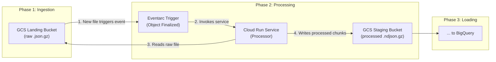

# Phase 2 Design: GitHub Archive Processing

## 1. Executive Summary

Phase 2 is the core transformation stage of the data pipeline. It is triggered when new raw GitHub Archive files arrive in the GCS landing bucket from Phase 1. Its primary objective is to process these large, compressed JSON files in a memory-efficient and scalable manner. This involves validating data quality, cleaning records, flattening the nested JSON structure into a tabular format, and enriching the data with ETL metadata. The processed, cleaned data is then written to a staging GCS bucket as gzipped, newline-delimited JSON (`.ndjson.gz`) files, ready for bulk ingestion into BigQuery by Phase 3.

## 2. Architecture Overview

### High-Level Data Flow



### Key Components

| Component | Resource Type | Name Pattern | Responsibility |
|-----------|--------------|--------------|----------------|
| **Event Trigger** | Eventarc Trigger | `${env}-github-archive-storage` | Listens for new objects in the landing bucket and invokes the Cloud Run processor. |
| **Compute** | Cloud Run Service (v2) | `${env}-github-archive-processor` | Downloads, validates, transforms, and writes data in chunks. |
| **Storage** | Cloud Storage Bucket | `${project_id}-${env}-github-archive-staging` | Stores processed, chunked `.ndjson.gz` files for Phase 3. |
| **Service Identity** | Service Account | `${env}-github-archive-processor@...` | Identity for the Cloud Run service with permissions to read from landing and write to staging. |
| **Invoker Identity** | Service Account | `${env}-eventarc-invoker@...` | Identity used by Eventarc to invoke the authenticated Cloud Run service. |

## 3. Detailed Technical Design

### 3.1. Triggering Mechanism (Eventarc)

*   **Event Source**: Google Cloud Storage.
*   **Event Type**: `google.cloud.storage.object.v1.finalized`.
*   **Filtering**:
    *   **Bucket**: Trigger is filtered to the landing bucket (`${project_id}-${env}-github-archive-landing`).
    *   **Path**: GCS events for Eventarc do **not** support path/prefix filtering. The application code must validate the object path (e.g., `github-archive/raw/`) to prevent unintended processing.
*   **Acknowledgement Deadline**: The underlying Pub/Sub subscription's acknowledgement deadline is explicitly set to **600 seconds** (10 minutes). This is critical, as the default of 10 seconds is too short for processing large files, which would cause repeated redeliveries and duplicate processing.

### 3.2. Processing Logic (Cloud Run Service)

The core logic is encapsulated in the `dev-github-archive-processor` container, which runs a Python application.

*   **Memory Efficiency**: The primary challenge is handling large files (e.g., 400MB+) without running out of memory. The solution is **chunked processing**, implemented in `processors/file_processor.py`.
    *   The entire file is downloaded from GCS to a temporary local file on the Cloud Run instance.
    *   `pandas.read_json` is used with the `chunksize` parameter (e.g., 100,000 lines) to create an iterator.
    *   Each chunk is processed and written to GCS independently, ensuring memory usage remains low and constant.
*   **Validation (`validators/file_validator.py`)**:
    *   **Filename**: The filename is validated for the correct format (`YYYY-MM-DD-H.json.gz`).
    *   **Data Types**: Dtypes are coerced (e.g., strings to timestamps).
    *   **Null Handling**: A distinction is made between nulls present in the source data and nulls created by failed dtype coercion. Only coercion failures are counted as errors, preventing valid source nulls from being flagged.
*   **Transformation (`processors/transformer.py`)**:
    *   **Flattening**: The nested JSON structure is flattened into a tabular format suitable for BigQuery.
    *   **Enrichment**: Two ETL metadata columns are added to each record for data lineage:
        *   `etl_create_ts`: Timestamp of processing.
        *   `etl_create_id`: A static identifier for the processor.
*   **Output (`writers/ndjson_writer.py`)**:
    *   Each processed chunk is written to a **separate** file in the staging bucket.
    *   **Format**: Newline Delimited JSON, compressed with Gzip (`.ndjson.gz`).
    *   **Path**: `processed/{YYYY-MM-DD-H}-chunk-{NNN}.ndjson.gz`. This ensures that even if the pipeline is retried on a single input file, the output is idempotent and ready for BigQuery's bulk loading.

### 3.3. Storage Design (Staging Bucket)

*   **Bucket Name**: `${project_id}-${env}-github-archive-staging`
*   **Object Path**: `processed/{original-filename}-chunk-{NNN}.ndjson.gz`
*   **Lifecycle Policy**: A 2-day retention policy is applied to objects. While Phase 3 deletes files after a successful BigQuery load, this policy serves as a safety net for debugging and prevents orphaned files from accumulating.

### 3.4. Security & IAM

Following the principle of least privilege, several service accounts are used.

*   **Processor Service Identity** (`${env}-github-archive-processor@...`): Runs the application code.
    | Role | Resource | Purpose |
    |------|----------|---------|
    | `roles/storage.objectViewer` | Landing Bucket | Read raw input files. |
    | `roles/storage.objectAdmin` | Staging Bucket | Create and delete processed chunk files. `objectAdmin` is required over `objectCreator` to allow overwriting/deleting during reprocessing. |
    | `roles/logging.logWriter` | Project | Write application logs. |

*   **Eventarc Invoker Identity** (`${env}-eventarc-invoker@...`): Used by the trigger system.
    | Role | Resource | Purpose |
    |------|----------|---------|
    | `roles/run.invoker` | Cloud Run Service | Permission to invoke the authenticated processor service. |
    | `roles/eventarc.eventReceiver` | Project | Standard role for Eventarc triggers. |

*   **Google-Managed Pub/Sub Service Agent**:
    *   This agent requires the `roles/iam.serviceAccountTokenCreator` role on the **Eventarc Invoker SA**. This is a critical and often missed permission that allows the Pub/Sub system to generate the OIDC token needed to call the authenticated Cloud Run service.

## 4. Deployment Strategy (Layered Terraform)

Deployment is automated via a layered Terraform approach, orchestrated by the `phase2_layered_deployment_script.sh` script. This separates resources by their lifecycle and dependencies.

*   **Layer 01 (Static)**: Deploys long-lived, foundational resources like Service Accounts, IAM bindings, and GCS buckets.
*   **Layer 02 (First-Time)**: Enables necessary APIs (`run.googleapis.com`, `eventarc.googleapis.com`, etc.) and sets up resources that are created once per project, like the Cloud Build trigger.
*   **Layer 03 (Operational)**: Deploys the application resources that change frequently, primarily the Cloud Run service and the Eventarc trigger that connects to it.

Container images are built using Cloud Build, as defined in `cloudbuild.yaml`, and pushed to Artifact Registry. The deployment script can trigger this build or deploy a specified image tag.

## 5. Operational Considerations

### 5.1. Error Handling & Idempotency
*   **Retries**: The Eventarc trigger uses an exponential backoff retry policy. The Cloud Run service is designed to be idempotent; re-processing the same input file will overwrite the output chunks in the staging bucket.
*   **Partial Failures**: The `blob.reload()` operation, which fetches metadata, is wrapped in a `try/except` block. A failure here is non-critical and should not fail the entire process.
*   **Poison Pills**: If a file consistently fails processing, it will be retried by Eventarc until the message retention period expires, after which it will be sent to a Dead-Letter Queue if configured.

### 5.2. Monitoring & Logging
*   **Logs**: Application logs are written to Cloud Logging. They can be viewed in the Google Cloud Console by filtering on the Cloud Run service name (`resource.type="cloud_run_revision"` and `resource.labels.service_name="${env}-github-archive-processor"`).
*   **Metrics**: Key metrics to monitor for the Cloud Run service include:
    *   `run.googleapis.com/request_count`: To monitor invocation frequency.
    *   `run.googleapis.com/request_latencies`: To track processing duration.
    *   `run.googleapis.com/container/cpu/utilization` and `run.googleapis.com/container/memory/utilization`: To ensure resources are adequately provisioned.

### 5.3. Key Learnings & Constraints
*   **Cloud Run v2 Memory**: The v2 execution environment requires a minimum of **512Mi** of memory if CPU is not throttled.
*   **IAM Propagation**: IAM policy changes can take up to 60 seconds to propagate. Terraform `depends_on` is not sufficient. Deployment scripts must account for this potential delay.
*   **Reserved Env Var `PORT`**: The `PORT` environment variable is reserved by Cloud Run and cannot be set manually in the service configuration.
*   **Overwrite Permissions**: `roles/storage.objectCreator` is insufficient for reprocessing files as it does not grant `storage.objects.delete` permission, which is required to overwrite an existing object. `roles/storage.objectAdmin` is used instead on the staging bucket.

## 6. Development Workflow

1.  **Code Changes**: Modify Python source code in `src/github_archive/phase2_process_files/`.
2.  **Local Testing**: Use the test script `infrastructure/github_archive/phase2_process_files/scripts/test_cloud_run.sh` to perform health checks and simulated invocations against a deployed service.
3.  **Image Build**: Use the deployment script with the `--use-cloud-build` flag to submit the build to Cloud Build.
    ```bash
    ./infrastructure/github_archive/phase2_process_files/scripts/phase2_layered_deployment_script.sh --layer operational --use-cloud-build
    ```
4.  **Infrastructure Deploy**: The same script will then run `terraform apply` on the operational layer, deploying the new Cloud Run revision with the newly built container image.
