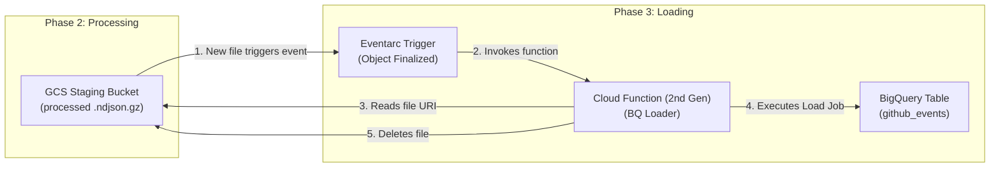

# Phase 3 Design: BigQuery Loading

## 1. Executive Summary

Phase 3 is the final, data-loading stage of the pipeline. It is triggered when Phase 2 deposits processed, cleaned `.ndjson.gz` files into the GCS staging bucket. The primary objective of this phase is to efficiently bulk-load these files into the central BigQuery data warehouse table. This is accomplished using a serverless Cloud Function that leverages BigQuery's high-performance, free bulk loading capabilities. After a successful load, the function cleans up by deleting the processed file from the staging bucket.

## 2. Architecture Overview

### High-Level Data Flow



### Key Components

| Component | Resource Type | Name Pattern | Responsibility |
|-----------|--------------|--------------|----------------|
| **Event Trigger** | Eventarc Trigger | `${env}-bq-loader-*` | Listens for new objects in the staging bucket and invokes the Cloud Function. |
| **Compute** | Cloud Function (2nd Gen) | `${env}-bq-loader` | Executes the BigQuery load job and deletes the source file. |
| **Data Sink** | BigQuery Table | `${project_id}.${dataset_id}.github_events` | The final destination for the processed event data. |
| **Service Identity** | Service Account | `${env}-bq-loader@...` | Identity for the Cloud Function with permissions to load data into BigQuery and manage GCS objects. |
| **Invoker Identity** | Service Account | `${env}-eventarc-invoker@...` | Identity used by Eventarc to invoke the authenticated Cloud Function. |

## 3. Detailed Technical Design

### 3.1. Triggering Mechanism (Eventarc)

The loading process is initiated by an Eventarc trigger that is implicitly created and managed by the `google_cloudfunctions2_function` Terraform resource.

*   **Event Source**: Google Cloud Storage.
*   **Event Type**: `google.cloud.storage.object.v1.finalized`.
*   **Filtering**:
    *   **Bucket**: The trigger is filtered to the staging bucket (`${project_id}-${env}-github-archive-staging`).
    *   **Path**: The application code validates that the object name has the `processed/` prefix to avoid acting on other files.
*   **Acknowledgement Deadline**: Cloud Functions 2nd gen automatically configures the underlying Pub/Sub subscription with a **600-second (10 minute)** acknowledgement deadline, which is sufficient for the load job.
*   **Retry Policy**: A default exponential backoff retry policy is automatically configured, handling transient failures.

### 3.2. Loading Logic (Cloud Function)

The core logic is contained within the `dev-bq-loader` Cloud Function, which runs a Python application.

*   **Framework**: The function uses `functions-framework` and is decorated with `@functions_framework.cloud_event` to handle the incoming CloudEvent payload.
*   **Event Parsing**: The function entrypoint receives a `CloudEvent` object. The GCS bucket and file name are extracted from the `cloud_event.data` attribute.
*   **Validation**: Before proceeding, the function performs two critical checks:
    1.  `file_name.startswith("processed/")`: Ensures it only processes files from the correct directory.
    2.  `file_name.endswith(".ndjson.gz")`: Ensures it only processes files of the expected format.
*   **BigQuery Load Job**:
    *   The function uses the `bq_client.load_table_from_uri()` method, which is the standard for efficient bulk loading from GCS.
    *   **`job_config`**: A `bigquery.LoadJobConfig` object is configured with the following key parameters:
        *   `source_format=bigquery.SourceFormat.NEWLINE_DELIMITED_JSON`: Informs BigQuery about the file format. BigQuery automatically handles the `.gz` decompression.
        *   `write_disposition=bigquery.WriteDisposition.WRITE_APPEND`: New data is appended to the existing table.
        *   `ignore_unknown_values=True`: This is a crucial setting for schema flexibility. If Phase 2 adds new columns to the `.ndjson` files, the load job will not fail; it will simply ignore the extra fields that are not yet in the BigQuery table schema.
*   **Cleanup**:
    *   After the `load_job.result()` call completes successfully, the function proceeds to delete the source file from the GCS staging bucket.
    *   This is controlled by the `DELETE_AFTER_LOAD` environment variable.
    *   This step is essential for preventing data duplication from accidental re-runs and for managing storage costs.

### 3.3. Data Sink (BigQuery Table)

*   **Dataset**: `github_archive`
*   **Table**: `github_events`
*   **Schema Management**: The table schema is defined declaratively in a `schema.json` file and managed by the Layer 01 Terraform configuration for Phase 3. The schema is not auto-detected at load time; it is pre-defined and enforced.
*   **Partitioning**: The `created_at` column is of type `TIMESTAMP`, allowing for time-based partitioning, which is critical for query performance and cost management.

### 3.4. Security & IAM

As Cloud Functions 2nd gen run on Cloud Run, the IAM model is similar to Phase 2, involving a service identity and an invoker.

*   **Function Service Identity** (`${env}-bq-loader@...`): Runs the application code.
    | Role | Resource | Purpose |
    |------|----------|---------|
    | `roles/bigquery.dataEditor` | BigQuery Dataset | Permission to append data to tables. |
    | `roles/bigquery.jobUser` | Project | Permission to run BigQuery jobs (including load jobs). |
    | `roles/storage.objectAdmin` | Staging Bucket | Read source files and delete them after loading. |
    | `roles/logging.logWriter` | Project | Write application logs. |

*   **Eventarc Invoker Identity** (`${env}-eventarc-invoker@...`): Used by the trigger system.
    | Role | Resource | Purpose |
    |------|----------|---------|
    | `roles/run.invoker` | Cloud Function | Permission to invoke the authenticated function. |
    | `roles/eventarc.eventReceiver` | Project | Standard role for Eventarc triggers. |

## 4. Deployment Strategy (Layered Terraform)

Deployment is automated via a layered Terraform approach.

*   **Layer 01 (Static)**: Deploys the foundational resources: the BigQuery dataset and table (with its schema), the service accounts, and necessary IAM bindings.
*   **Layer 02 (First-Time)**: Enables the `cloudfunctions.googleapis.com` API.
*   **Layer 03 (Operational)**: Deploys the `google_cloudfunctions2_function` resource. This single resource manages the build, deployment, and configuration of the function, as well as the creation of the associated Eventarc trigger.

The source code is zipped and uploaded during the Terraform apply process.

## 5. Operational Considerations

### 5.1. Error Handling & Retries
*   **Automatic Retries**: If the Cloud Function fails (e.g., due to a temporary BigQuery API outage), the underlying Eventarc/Pub/Sub system will automatically retry the invocation with an exponential backoff. The function code ensures this by re-raising exceptions on failure.
*   **Poison Pills**: Files that consistently fail to load (e.g., due to a data corruption that violates the BigQuery schema) will be retried until the message retention period expires, after which they can be sent to a Dead-Letter Queue if configured.

### 5.2. Idempotency
*   The process is **not inherently idempotent**. If a file is loaded successfully but the subsequent GCS delete operation fails, a retry of the event could cause the same data to be loaded twice.
*   The `DELETE_AFTER_LOAD` mechanism makes this scenario unlikely, but it's a known risk. True idempotency would require a more complex system of tracking loaded files in a transactional database or using BigQuery's `MERGE` statement, which is overkill for this append-only use case.

### 5.3. Monitoring & Logging
*   **Logs**: As a 2nd gen function, logs are written to Cloud Logging under the Cloud Run resource type. They can be filtered by `resource.type="cloud_run_revision"` and `resource.labels.service_name="${env}-bq-loader"`.
*   **Metrics**: Key metrics to monitor include:
    *   `run.googleapis.com/request_count`: To monitor invocation frequency. A count of zero may indicate an issue with the Phase 2 output or the Eventarc trigger.
    *   `run.googleapis.com/request_latencies`: To track loading duration.
    *   BigQuery Load Job metrics (viewable in the BigQuery UI) provide details on rows loaded, errors, and processing time.

## 6. Development Workflow

1.  **Code Changes**: Modify Python source code in `src/github_archive/phase3_loadbigquery/`.
2.  **Schema Changes**: If the schema changes, update `infrastructure/github_archive/phase3_loadbigquery/terraform/layers/01_static/schema.json` and apply the static layer.
3.  **Infrastructure Deploy**: Run the deployment script for the operational layer. Terraform will automatically package, upload, and deploy the new version of the Cloud Function.
    ```bash
    # (Example command)
    ./infrastructure/github_archive/phase3_loadbigquery/scripts/phase3_layered_deployment_script.sh --layer operational
    ```