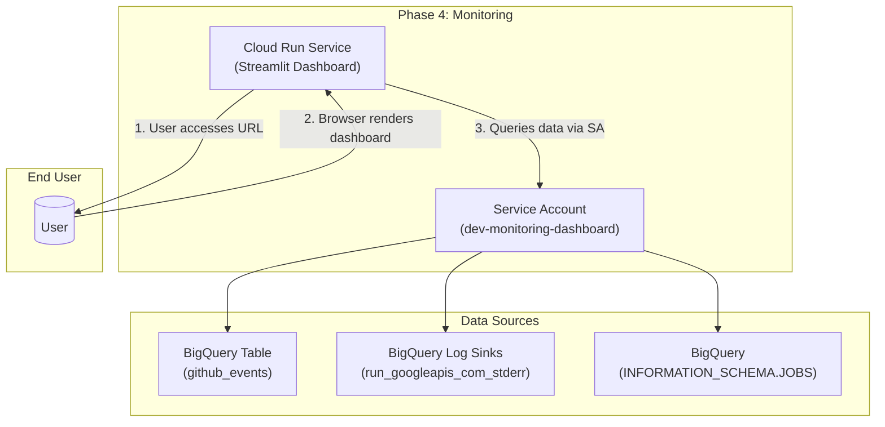

# Phase 4 Design: Monitoring Dashboard

## 1. Executive Summary

Phase 4 provides critical visibility into the health, performance, and cost of the entire GitHub Archive data pipeline. It consists of a single, serverless web application—a monitoring dashboard—deployed as a Cloud Run service. This dashboard does not process data in the pipeline; instead, it queries various data sources within Google Cloud, including BigQuery data tables, log-based metrics, and job information schemas, to present a unified, near real-time view of the system's operational status. Its primary objective is to enable developers and operators to quickly diagnose issues, track processing throughput, and monitor costs without inspecting individual service logs.

## 2. Architecture Overview

### High-Level Data Flow

The dashboard is a read-only component that pulls data from various sources created by the other pipeline phases.



### Key Components

| Component | Resource Type | Name Pattern | Responsibility |
|-----------|--------------|--------------|----------------|
| **Compute** | Cloud Run Service (v2) | `${env}-monitoring-dashboard` | Hosts the Streamlit Python web application. |
| **Data Sources** | BigQuery Tables | `github_events`, `run_googleapis_com_stderr` | Provides the raw data and logs for the dashboard to query. |
| **Metadata Source** | BigQuery View | `INFORMATION_SCHEMA.JOBS` | Provides metadata about BigQuery jobs run by Phase 1 and Phase 3. |
| **Service Identity** | Service Account | `${env}-monitoring-dashboard@...` | Identity for the dashboard service with read-only permissions to the data sources. |

## 3. Detailed Technical Design

### 3.1. Dashboard Logic (Cloud Run Service)

The core of Phase 4 is a Python application built with the Streamlit framework, packaged as a Docker container, and deployed on Cloud Run.

*   **Framework**: Streamlit is used for its ability to rapidly create data-centric web applications.
*   **Data Queries**: The dashboard executes several targeted BigQuery SQL queries to gather metrics:
    *   **Phase 1 (Ingestion)**: Queries `INFORMATION_SCHEMA.JOBS` to find the status and execution details of the Cloud Run jobs responsible for downloading the raw archive files.
    *   **Phase 2 (Processing)**: Queries the log sink table (`run_googleapis_com_stderr`) to analyze structured logs from the Phase 2 processor. This provides metrics on files processed, records transformed, and validation errors.
    *   **Phase 3 (Loading)**: Queries `INFORMATION_SCHEMA.JOBS` to track the status, duration, and number of rows loaded by the BigQuery load jobs initiated by the Cloud Function.
    *   **Overall Throughput**: Queries the final `github_events` table to calculate aggregate statistics, such as events processed per hour and the distribution of event types.
*   **Error Handling**: The application code includes `try/except` blocks around its query functions. This is critical because the log sink tables in BigQuery are only created when the first log entries arrive. The dashboard will gracefully handle the absence of these tables at startup and display a message instead of crashing.

### 3.2. Data Sources (BigQuery)

The dashboard relies on three distinct types of data within BigQuery, all queried via the dashboard's service account:

*   **Main Data Table**: `${project_id}.github_archive.github_events`
*   **Log Sink Table**: The dashboard specifically queries `run_googleapis_com_stderr` because the Python `logging` module in the Phase 2 processor writes to `stderr` by default.
*   **Information Schema**: The project-level `INFORMATION_SCHEMA.JOBS` view provides metadata about all BigQuery jobs run in the project.

### 3.3. Security & IAM

The dashboard's service account (`${env}-monitoring-dashboard@...`) is granted a specific, limited set of read-only permissions to follow the principle of least privilege.

| Role | Resource | Purpose |
|------|----------|---------|
| `roles/bigquery.dataViewer` | BigQuery Dataset (`github_archive`) | Allows reading data from the `github_events` table. |
| `roles/bigquery.resourceViewer` | Project | Allows querying the `INFORMATION_SCHEMA.JOBS` view to get metadata about jobs. |
| `roles/bigquery.jobUser` | Project | Allows the service account to run query jobs against the data. |
| `roles/logging.logWriter` | Project | Standard role to allow the Cloud Run service to write its own operational logs. |

## 4. Deployment Strategy (Layered Terraform)

Deployment is automated via a layered Terraform approach, consistent with the other pipeline phases.

*   **Layer 01 (Static)**: Deploys the foundational resources: the service account for the dashboard and the necessary IAM bindings that grant it read access to the BigQuery resources created in other phases.
*   **Layer 02 (First-Time)**: Enables the `run.googleapis.com` API if not already enabled.
*   **Layer 03 (Operational)**: Deploys the `google_cloud_run_v2_service` resource. This resource defines the dashboard's container, environment variables, and service identity.

The dashboard's Docker container image is built using a dedicated `cloudbuild.yaml` file and pushed to Artifact Registry. The operational deployment layer then references this image.

## 5. Operational Considerations

### 5.1. Cost Optimization

The dashboard is a low-traffic, internal-facing tool. To minimize cost, it is configured for request-based billing, which is a key learning from initial project cost analysis.

*   **CPU Throttling**: The Cloud Run service is configured with `cpu_idle = true`. This allows the service to scale to zero when not in use, meaning it only incurs CPU costs when actively handling user requests. A cold start of 2-5 seconds upon first access is an acceptable trade-off for the significant cost savings.

### 5.2. Error Handling & Resilience

*   The dashboard is not a critical component of the data processing pipeline. Its failure has no impact on the ingestion, processing, or loading of GitHub Archive data.
*   As noted in the design, it is resilient to the initial absence of log sink tables in BigQuery, preventing crashes during the initial project setup.

### 5.3. Monitoring

The dashboard itself is a Cloud Run service and can be monitored using standard Cloud Monitoring metrics:
*   `run.googleapis.com/request_count`: To see how often the dashboard is being used.
*   `run.googleapis.com/request_latencies`: To track the performance of the dashboard and its underlying BigQuery queries.
*   `run.googleapis.com/container/cpu/utilization` and `run.googleapis.com/container/memory/utilization`: To ensure the service is provisioned with adequate resources.

## 6. Development Workflow

1.  **Code Changes**: Modify the Streamlit Python source code in `src/github_archive/phase4_monitoring/`.
2.  **Image Build**: Use a deployment script that invokes `gcloud builds submit` with the appropriate `cloudbuild.yaml` to build and push a new container image to Artifact Registry.
3.  **Infrastructure Deploy**: Run the deployment script for the operational layer. Terraform will create a new Cloud Run revision with the updated container image.
    ```bash
    # (Example command)
    ./infrastructure/github_archive/phase4_monitoring/scripts/phase4_layered_deployment_script.sh --layer operational --use-cloud-build
    ```